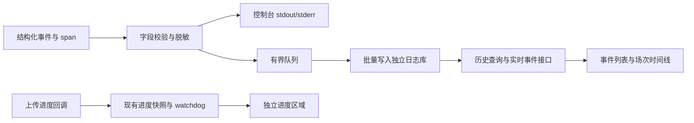

# 日志系统重构：初步方向

Status: needs-triage
来源：[dplei/biliup#2](https://github.com/dplei/biliup/issues/2)，含补充的事故复盘建议。

本轮只整理方向与实施拆分，不实现、不迁移数据。以下参数是待验证的起点，不是已经生效的配置。
按本次要求，目标是**应用不再自动生成本地 `.log` 文件**；issue 中保留文件日志、把完整
stderr 另存文件的建议，调整为控制台兜底和有界数据库诊断附件。

## 1. 建议结论

- 用结构化事件表达「发生了什么」，数据库负责保存，前端负责读得懂；不再解析格式化日志行。
- `INFO / WARN / ERROR` 表示严重程度；录制、上传、投稿等表示业务分类，两个维度独立。
- 上传进度属于可覆盖的状态，继续使用已有进度快照与独立展示，不逐次追加到事件表。
- 第一版使用**独立的本地 SQLite 日志库**（建议 `data/observability.sqlite3`），不挤占业务库
  的写锁和连接池；主业务库保持现状。两库仍共享磁盘资源，需要容量上限。
- 先不购买云数据库。将事件存取集中在一个小接口，后续有多实例汇总或异机留存需求时，再加
  PostgreSQL 后端或异步汇聚。SQLx 现有配置仅启用 SQLite，不能只换连接串就变成云端 SQL。
- 保留结构化 stdout/stderr，用于启动失败、日志库不可用和崩溃排查；不创建文件兜底。
  运行环境是否收集控制台输出是另外一层策略，不应让网页依赖它的文件。

## 2. 从代码确认的现状

| 入口 / 模块 | 当前行为 | 重构影响 |
| --- | --- | --- |
| `crates/stream-gears/src/server.rs` | CLI 主循环初始化控制台和按天滚动文件，时间精度到秒，共用总过滤器 | 去除文件 sink，过滤器分流，补毫秒时间 |
| `crates/biliup-cli/src/main.rs` | Rust CLI 单独初始化控制台日志 | 和 wheel 主循环共用初始化组件，不能只改一个入口 |
| `crates/stream-gears/src/lib.rs` | Python 下载/上传函数各有局部 subscriber，分别写文件 | 同步处理嵌入模式，避免绕过新的采集链 |
| `crates/biliup-cli/src/server/api/ws.rs` | 初连遍历文件取末尾 50 行，之后每 500ms 检查文件变化 | 改为查询事件和消费已提交事件，不再 tail 文件 |
| `app/(app)/logviewer/page.tsx` | 按文件分 tab，接收字符串不断追加到数组，通过静态文件路径下载 | 改为分级筛选、分页、限量渲染及按查询导出 |
| `crates/biliup-cli/src/server/common/upload.rs` | 已有 `UploadActivity` 和数据库进度快照；首次/累计新增 16MiB/经过 5 秒触发保存，保存时又发 `INFO` | 保留快照、心跳和 watchdog，拆掉进度与普通日志的耦合 |
| `crates/biliup-cli/src/server/common/attempt_lease.rs` | 已有阶段、心跳、attempt 历史 | 继续作为业务状态依据，事件库只提供观察记录 |
| `crates/biliup/src/downloader/httpflv.rs` | 连接诊断有部分 `attempt_id`；DTS 等告警仍是自由文本，没有直接携带当前分段身份 | 优先补关联上下文和稳定事件名 |
| `crates/biliup-cli/src/server/infrastructure/connection_pool.rs` | SQLite 类型固定、池上限 2，使用现有业务 migrations | 日志库独立建池和迁移目录，不复用业务库建库函数 |
| `crates/biliup-cli/src/server/common/ffmpeg_scan.rs` | 扫描 stderr 已流式处理，只保留有界尾部 | 复用采集边界，不重新无限收集完整 stderr |

补充：当前 WebSocket 日志路由在 `app.rs` 的登录保护路由组装后追加；新接口和兼容入口均须
明确纳入认证边界并做未登录验证。`app/ui/plugins/developer.tsx` 和主播页的日志下载按钮也
依赖旧文件语义，不能只替换日志页。

## 3. 三类信息分别管理

| 信息 | 示例 | 保存 / 展示 |
| --- | --- | --- |
| 运维事件 | 开始录制、切片结束、重试、降级、上传失败、投稿成功 | 追加到 `log_event`，可查询、关联、导出 |
| 运行状态 | 已上传字节、速度、当前阶段、心跳 | 复用业务快照；需要更实时再加覆盖式内存状态，不堆事件行 |
| 诊断详情 | 外部工具退出码、错误链、stderr 片段 | 摘要进入事件；有界附件单独保存，点击展开 |

业务账本、提交意图、attempt 租约、恢复审计仍由原业务模型负责。删除日志不能影响任务恢复，
也不能把通用事件表当作业务状态机或投稿幂等依据。

### 分级规则

| 级别 | 含义 | 例子 |
| --- | --- | --- |
| `INFO` | 正常关键事件或预期决策 | 开始/完成；配置关闭所以跳过；正常排队 |
| `WARN` | 出现异常或非预期降级，目前仍能继续处理 | 连接中断后重试、质量低于阈值、修复失败后直传 |
| `ERROR` | 本次操作已失败，或目标状态无法可靠确认 | 尝试耗尽、数据无法登记、投稿结果不确定 |
| `DEBUG / TRACE` | 开发诊断细节 | 每块进度、内部轮询；默认不持久化 |

级别不等于任务最终状态：一条 `ERROR` 可以随后恢复，一条 `WARN` 也可能最终失败。
界面显示 `outcome`、后续恢复事件和权威任务状态，不能只靠红黄颜色推断。
预期降级是否为 `INFO` 应按业务规则定义，不能把所有 fallback 自动升为告警。

建议分类：`system / recording / upload / submission / processing / auth / audit`。
「警告与错误」是级别筛选视图，不再另造一个与上述分类混用的类型。

## 4. 事件模型：人能读，程序能查

建议一个主表 `log_event`，固定查询列 + 扩展 JSON；不要把整行文本原封不动塞入数据库。

| 字段组 | 建议字段与约束 |
| --- | --- |
| 身份与版本 | `id`（入库序号）、`event_uid`（跨重试唯一）、`schema_version`、`instance_id`、`process_run_id`、`app_version` |
| 时间与排序 | `occurred_at_ms`（UTC 毫秒）、`ingested_at_ms`、进程内 `sequence`；前端转换本地时区 |
| 语义 | `level`、`category`、稳定 `event_name`、`message`（简短中文摘要）、`outcome`、`reason_code` |
| 来源 | `target`；源码文件/行号可作辅助，不能作为事件身份 |
| 关联 | `live_streamer_id`、`streamer_info_id`、`upload_session_id`、`segment_id`、`missing_id`、`download_attempt_id`、`upload_attempt_id`、独立命令的 `task_id` |
| 展示与详情 | 主播名称快照、`original_file`、`artifact_file`、`fields_json`、可选 `diagnostic_id` |

关键约束：

1. **录制场次和投稿会话不能混叫 `session`。** `Context::id()` 是 `streamer_info.id`，上传中
   一些 `session` 字段则是 `upload_session.id`。服务端整场时间线以录制场次为主，两个 ID
   明确存储；投稿会话尚未创建时允许为空，不为打日志提前改变业务生命周期。
2. 文件创建时就分配稳定分段身份，分段关闭、登记、上传、补传均传递它。不能等 `missing_id`
   产生后才有身份。分段身份与原文件的映射需要随登记保存，重启/补扫可找回；转码临时文件
   作为 artifact 关联，不覆盖原分段身份。
3. 单条服务端任务事件应能回答「哪个主播、哪一场、哪个分段」。启动阶段或尚未创建文件时，
   允许相关字段为空，但必须有阶段/尝试身份；独立 CLI 用 `task_id`，不伪造主播和场次。
4. ID 不通过跨库外键级联删除；主播/文件删除后历史事件仍有必要的展示快照。不同实例的
   自增业务 ID 必须与 `instance_id` 一起使用。
5. 稳定事件名如 `recording.dts_backward`、`processing.timestamp_repair_decided`；数值用
   `_ms / _secs / _bytes` 标明单位。中文文案可以修改，不影响检索和统计。
6. 同时保留中文摘要与真正的结构化字段，不要求用户阅读一长串 key=value。JSON/JSONL
   导出时换行正常转义，每条记录独立可解析；不再用分号、冒号或正则拆原始消息取业务字段。
7. 毫秒时间只提高精度，不证明并发因果；用实例、进程序号、任务关联和阶段关系还原顺序。

推荐摘要样式：`警告 · 录制 · 检测到时间戳倒退，继续录制并标记待检查`；展开后展示
`previous_ms / current_ms / segment_id` 等字段。示例不使用真实账号或生产标识。

### 上下文传递

在录制任务、连接尝试、分段、上传尝试边界创建 tracing span，使用 `.instrument(...)`
跨异步调用传递；`tokio::spawn`、阻塞任务、回调、Actor/channel 消息都要显式传递上下文。
不能依赖 tokio 线程 ID，也不能拿 `span.enter()` 的 guard 跨 `await`。
子任务传播方式参见 [tracing Instrument 文档](https://docs.rs/tracing/latest/tracing/trait.Instrument.html)。

采集层在 `on_new_span / on_record` 保存上下文字段，在 `on_event` 合并父子 span 和事件字段，
立刻形成自有快照再入队；分段切换必须更新对应作用域，不能使旧事件后来指向新文件。
字段覆盖规则显式约定为事件 > 子 span > 父 span。
生命周期回调见 [tracing-subscriber Layer 文档](https://docs.rs/tracing-subscriber/latest/tracing_subscriber/layer/trait.Layer.html)。

关键决策均记录 `outcome=executed|skipped|fallback|failed` 和 `reason_code`，特别是修复、
降级、补传资格、投稿等待/拒绝。周期扫描的同一等待原因不每轮追加，只记状态变化或汇总。
高频同类 DTS 告警可以保留首条和定期汇总（次数、首末时间、最大倒退值），分段/原因变化
必须另起记录；页面折叠与源端汇总须区分，汇总不能伪装成完整原始事件流。

## 5. 存储与故障边界

- 同步的 tracing 回调只复制字段、做有界处理、入队，不同步执行 SQL。后台单写入器批量
  提交；队列同时限制条数和字节数，WARN/ERROR 预留容量。批次大小/刷新间隔用压测确定。
- 主业务库和日志库独立迁移、连接和关闭流程；日志库故障不阻止正常录制/上传服务启动。
  日志库使用 WAL、明确 busy timeout、短写事务和 checkpoint 策略；WAL 能改善读写并发，
  但仍只有一个 writer，不能把 WAL 数据库放网络共享盘跨机器写。
  参见 [SQLite WAL 文档](https://www.sqlite.org/wal.html)。
- 启动时先装控制台和有界缓冲，日志库就绪后按序排空；优雅退出限时 flush。
  **普通异步日志在强杀、掉电、队列满或磁盘故障时可能丢失，不能承诺零丢失。**
- 超载先牺牲 DEBUG/重复低价值事件，重要级别仍只能尽力保存；暴露队列深度、各级丢弃计数、
  最后成功写入时间和存储健康。恢复后记录缺口摘要，不能静默当成完整历史。
- 必须与操作一起持久保存的审计采用业务事务/事务 outbox，再按 `event_uid` 幂等投影到
  日志库；已有恢复审计继续保留。业务提交和日志库写入之间不假装有跨库原子性。
  这与分段登记的既有业务 outbox 不同，不因取消 `.log` 去删除业务恢复文件。
- 日志写入器自身、SQLx 查询明细、健康轮询不能再次无条件进入同一事件写入链，防止递归。
  存储故障通过独立计数和受限频率的 stderr 上报。
- 控制台和数据库采用独立过滤策略；不能让控制台被调到 ERROR 后，数据库也丢掉 INFO/WARN。
  已迁移事件优先持久化；遗留/第三方诊断用明确 `legacy` 来源与缺字段标记过渡，不能猜关联 ID。
- Cookie、Authorization、token、带签名 URL、原始请求响应均不直接入库或输出。以允许字段
  为主统一脱敏，诊断附件和导出同样处理；仅写一个 JSON formatter 不能自动做到脱敏。

诊断附件建议独立 `log_diagnostic` 表，保存退出码、首个致命错误、尾部片段、总字节数与
`truncated` 标记，单次捕获/存储均有上限。默认不保留无限量完整 stderr，也不另写 `.log`。
需要全量诊断时另做受限、短时的调试能力；第一版不承诺完整 stderr 归档。

## 6. 页面、查询与保留策略

- 默认「关键事件」列表，提供「警告与错误」「按业务分类」「按场次查看」；每行显示级别文字、
  图标、时间、主播/文件和中文摘要，详情折叠。用户翻旧日志时只提示有新事件，不强制滚到底。
- 按级别、类型、时间、事件名、主播、录制场次、上传会话、分段/尝试查询；进度在独立区域
  按任务覆盖更新。错误详情可跳到对应分段和整场事件链。
- 以 `/v1/log-events`、`/v1/log-events/stream`、`/v1/log-events/export` 为候选接口；历史查询
  使用游标分页和最大页长。实时流使用已提交的入库序号，断连按游标补查并按唯一 ID 去重，
  解决初始查询与订阅切换的竞态；游标过期明确提示保留期缺口。
- 默认按入库序号分页便于稳定追赶；事故视图可按 `(occurred_at_ms, id)` 排序，但不能据此
  宣称跨实例严格因果。补投事件保留原发生时间和新入库时间。
- 索引优先覆盖时间、`(streamer_info_id, occurred_at_ms, id)`、级别/类型加时间；若支持多个
  实例，关联索引加 `instance_id`。不为每个 JSON 属性建索引，依据查询计划再补。
- 日志查询、实时流、诊断详情、导出均纳入认证；导出分页流式生成 JSONL/CSV，不需要服务端
  落 `.log`；用户主动保存导出与应用持续写日志文件是两回事。
- 建议初值：普通事件 30 天，WARN/ERROR 90 天，诊断附件 7 天；审计按独立业务策略保留，
  不随普通日志清理。除时间外必须设置字节预算、低磁盘水位和清理优先级。
- 分批清理旧记录，维护 WAL/checkpoint；删行不等于文件立即缩小，空间回收放维护窗口并
  预留空间。备份必须使用一致性备份方式，不能运行中只复制主 `.sqlite3` 而遗漏 WAL。
- 前端使用有界缓存和虚拟列表；列表中「清空」仅清空当前显示，不删除数据库历史。

## 7. 本地还是云端 SQL

| 方案 | 适用条件 | 本轮建议 |
| --- | --- | --- |
| 本地独立 SQLite | 单服务或单机写入，希望维护简单、网络故障不影响记录 | **先做这个**；日志库与业务库隔离，另安排备份 |
| 自建 PostgreSQL | 已有 PostgreSQL 运维能力，确需多个写入端 | 非第一版必需；同机自建仍承担同机故障风险 |
| 托管 PostgreSQL，例如阿里云 RDS | 多实例汇总、希望异机留存、愿意承担托管费用 | 后续候选；购买前测量量级、查询延迟和网络路径 |

SQLite 官方将设备本地、低写并发列为适用场景；多机网络直连数据库更适合 client/server
数据库。这支持上述分阶段选择，但不是本项目容量已经实测通过的证明。
参见 [SQLite 适用场景](https://www.sqlite.org/whentouse.html)。

选择云端时优先同地域、可走私网、TLS、最小权限账号；不让录制/上传等待远程日志 SQL。
推荐保留本地数据库作为受限缓冲，再异步传送，避免断网丢链。迁移仅限日志，不顺手改造
全业务库、认证会话和全部 SQLite SQL。

云端费用需要一起核算计算、存储、备份与可能的传输费用；规格/地域未定，本轮不报一个
失真的固定月价，也不建议立即购买。费用维度依据
[RDS 计费项](https://www.alibabacloud.com/help/en/rds/product-overview/billable-items-billing-methods-and-pricing)。

## 8. 实施顺序与验收

| 阶段 | ticket | 结果 |
| --- | --- | --- |
| P0：先能定位 | [01 事件与关联模型](issues/01-event-context.md) + [03 进度与决策语义](issues/03-progress-and-decisions.md) | 关键告警能归属；跳过有原因；进度不刷普通日志 |
| P1：持久化 | [02 日志存储与生命周期](issues/02-event-storage.md) | 独立日志库、可靠性边界和诊断详情 |
| P2：可读可查 | [04 查询与界面](issues/04-query-and-ui.md) | 历史筛选、场次时间线、独立进度、导出 |
| P3：切换与验证 | [05 移除文件依赖](issues/05-cutover-and-validation.md) | 所有支持入口默认不再生成 `.log`，旧 API 有迁移安排 |

旧 `/v1/ws/logs?file=...` 可短期映射为数据库事件的文本投影，兼容文件名只作为来源筛选别名，
不再读写文件；映射并非旧文件字节级复刻，需要明确宣布废弃期。静态下载链接统一改成查询
导出。旧文件不默认解析导入、不自动删除；若需要历史导入，单独做 best-effort 工具，缺失
的关联字段保持未知，不通过时间猜测补造。

核心验收：

1. 多路同时录制、切片、重连、预处理和补传，告警始终关联正确的场次/分段；不存在串台。
2. 给定录制场次，一次查询串起录制到投稿的事件链，含必要的 skipped/fallback 和恢复结论。
3. 持续上传时进度正常变化，普通事件数不随分块数量线性增加；原 watchdog/心跳判定不变。
4. 正常重启后可查已提交事件；另测强杀、队列溢出、数据库锁住/满盘，能看到持久化健康或
   缺口，录制不会因日志后台长期等待而停住。
5. 分页不重不漏、断线补查可用、附件有上限；用合成大数据检查索引和录制并发下的性能。
6. 数据库查询结果、JSONL 和前端摘要一致；敏感数据不会从日志/诊断/导出泄漏。
7. Rust CLI、wheel CLI、Python 下载/上传函数分别验证；无新 `.log`，现有外部输出文件不删除。

尚待实施前细化：事件目录第一批范围、分段身份兼容映射、容量预算与丢弃策略、旧 API 保留
窗口、是否确有跨机器汇总需求。以上均可按本稿默认方向继续细化，不以购买云服务为前置条件。
